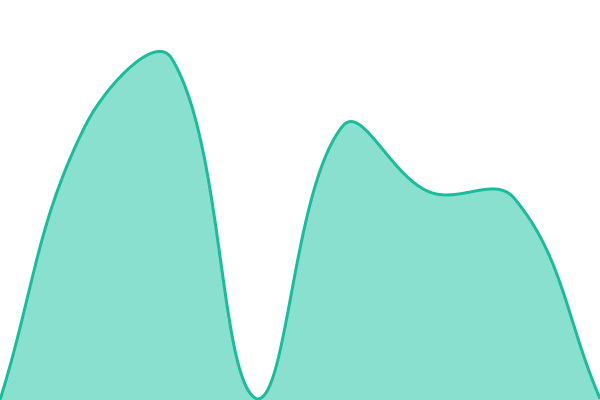
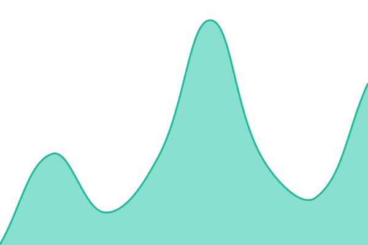

Site: https://davidespinozaromero.github.io/checkapps/

# [📈 Live Status](https://demo.upptime.js.org): <!--live status--> **🟩 All systems operational**

This repository contains the open-source uptime monitor and status page for [David Emanuel Espinoza Romero](https://davidespinozaromero.github.io/), powered by [Upptime](https://github.com/upptime/upptime).

With [Upptime](https://upptime.js.org), you can get your own unlimited and free uptime monitor and status page, powered entirely by a GitHub repository. We use [Issues](https://github.com/DavidEspinozaRomero/checkapps/issues) as incident reports, [Actions](https://github.com/DavidEspinozaRomero/checkapps/actions) as uptime monitors, and [Pages](https://demo.upptime.js.org) for the status page.

<!--start: status pages-->
<!-- This summary is generated by Upptime (https://github.com/upptime/upptime) -->
<!-- Do not edit this manually, your changes will be overwritten -->
<!-- prettier-ignore -->
| URL | Status | History | Response Time | Uptime |
| --- | ------ | ------- | ------------- | ------ |
|  [Jornada Go](https://jornadago.netlify.app) | 🟩 Up | [jornada-go.yml](https://github.com/DavidEspinozaRomero/checkapps/commits/HEAD/history/jornada-go.yml) | 

 518ms
     
 | 

<a href="https://DavidEspinozaRomero.github.io/checkapps/history/jornada-go">100.00%</a>
    

|  [Jornada Go server](https://jornadagoserver.onrender.com/health) | 🟩 Up | [jornada-go-server.yml](https://github.com/DavidEspinozaRomero/checkapps/commits/HEAD/history/jornada-go-server.yml) | 

 169ms
     
 | 

<a href="https://DavidEspinozaRomero.github.io/checkapps/history/jornada-go-server">100.00%</a>
    

|  [Personal Page](https://davidespinozaromero.github.io) | 🟩 Up | [personal-page.yml](https://github.com/DavidEspinozaRomero/checkapps/commits/HEAD/history/personal-page.yml) | 

 119ms
     
 | 

<a href="https://DavidEspinozaRomero.github.io/checkapps/history/personal-page">100.00%</a>
    

<!--end: status pages-->

[**Visit our status website →**](https://demo.upptime.js.org)

## 📄 License

- Powered by: [Upptime](https://github.com/upptime/upptime)
- Code: [MIT](./LICENSE) © [David Emanuel Espinoza Romero](https://davidespinozaromero.github.io/)
- Data in the `./history` directory: [Open Database License](https://opendatacommons.org/licenses/odbl/1-0/)
